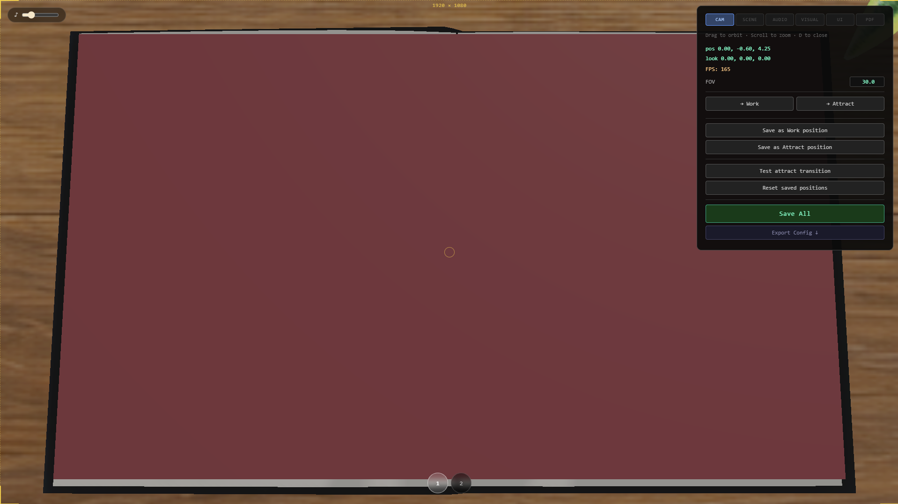

# Carte Touch — Interactive Kiosk Book



An offline, touchscreen "flip-book" application for kiosks. A set of page images is presented as a
realistic **3D book** the visitor can browse by tapping/swiping.

The 3D book (`index.html`) renders with WebGL and features a page-curl flip, decorative props,
lighting, an idle "attract" camera mode, English + Romanian support, a developer panel, and a
built-in PDF→pages importer.

Everything runs **100% offline** — no internet connection, CDN, or external service is required
at runtime.

---

## Running it

Double-click the launch script (it starts a tiny local web server and opens a browser):

- `start.bat` → opens the book at `http://localhost:8080`

> The app must be served over `http://` (the `.bat` file handles this). Opening `index.html`
> directly from disk will not work correctly (fullscreen, image loading).

Recommended browser: **Google Chrome** or **Microsoft Edge** (required for the PDF importer's
save-to-folder feature).

> The local server uses **built-in Windows PowerShell** by default — nothing to install. See
> [`INSTALL.md`](INSTALL.md) for requirements and optional Python setup.

---

## How pages work

Pages are plain image files loaded in numeric order from:

```
assets/pages/en/   ← English pages
assets/pages/ro/   ← Romanian pages
```

- Named `page-01.jpg`, `page-02.jpg`, … `page-100.jpg`, `page-200.jpg` (2-digit minimum).
- Formats: `.jpg` `.jpeg` `.png`, and also `.mp4` / `.webm` video pages (video pages are untested).
- Missing numbers are tolerated (up to 5 in a row) — the book skips gaps and stops after the end.

**Recommended image size** (portrait, per page):

| Tier | Pixels |
|------|--------|
| Minimum | 800 × 994 |
| Recommended | 1200 × 1491 |
| High | 1500 × 1865 |
| Overkill | 2000 × 2484 |

**Page images are not included in this repository** (see [`.gitignore`](.gitignore)). Drop the
`page-NN.jpg` files into the `assets/pages/<lang>/` folders on the deployment machine.

A full, non-technical operator manual is included:
- `admin-guide.html` (English) · `admin-guide-ro.html` (Romanian)

---

## Configuration

`assets/user-config.json` holds the default settings bundled with the kiosk (start language,
camera positions, lighting, audio levels, quality, navigation mode, etc.). You can adjust everything
live in the developer panel (press **D**), click **Save All**, then **Export Config** to regenerate
this file. The configured `book-lang` always wins on launch.

---

## Project structure

```
index.html            3D book viewer
book.js               3D scene, page-flip logic, PDF importer hook, navigation
attract.js            Idle/attract camera mode
dev.js                Developer panel
pdf-import.js         PDF → page-NN.jpg converter (dev panel)
config.js             Base config (sounds, colours, camera presets)
audio.js / music.js   Sound effects and background music
lib/                  three.js, GLTFLoader, TransformControls, pdf.js (+ worker)
assets/
  pages/en|ro/        Page images  (NOT in repo)
  models/             3D props (.glb) + manifest
  music/ sounds/      Audio
  textures/ book/     Table texture, page-edge graphic
  user-config.json    Bundled default settings
admin-guide*.html     Operator manual (EN / RO)
start.bat             Launcher
server.ps1            No-install local web server (Windows PowerShell)
```

---

## Third-party libraries

This project bundles the following open-source libraries (all served locally):

| Library | Version | Purpose | License |
|---------|---------|---------|---------|
| [three.js](https://threejs.org) | bundled (`lib/three.min.js`) | WebGL 3D rendering | MIT |
| three.js `GLTFLoader`, `TransformControls` | bundled | Load `.glb` models / editor gizmos | MIT |
| [pdf.js](https://mozilla.github.io/pdf.js/) | v3.x (`lib/pdf.min.js`) | Render PDF pages to images (importer) | Apache-2.0 (Mozilla) |

All bundled libraries use permissive licenses (MIT / Apache-2.0), which are compatible with
GPLv3. Each library retains its own copyright and license; see the headers inside the files in
`lib/`.

---

